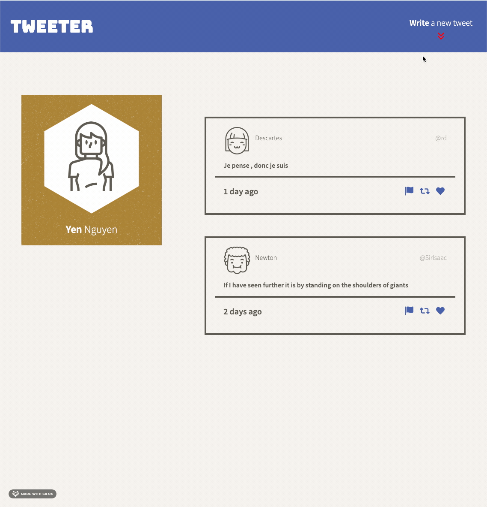
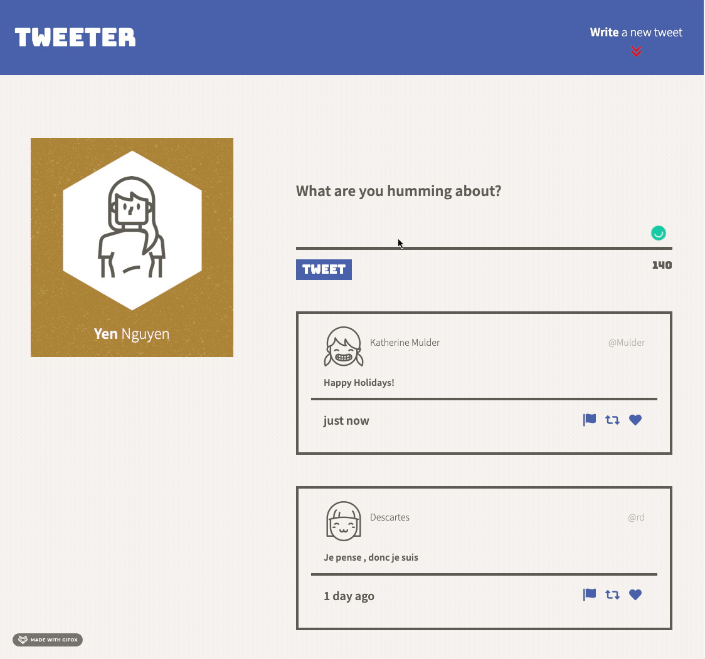
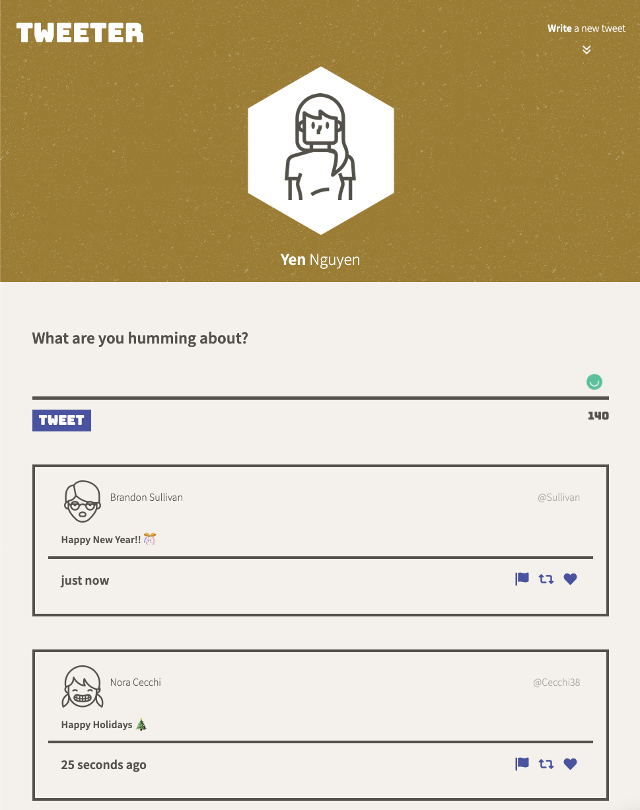
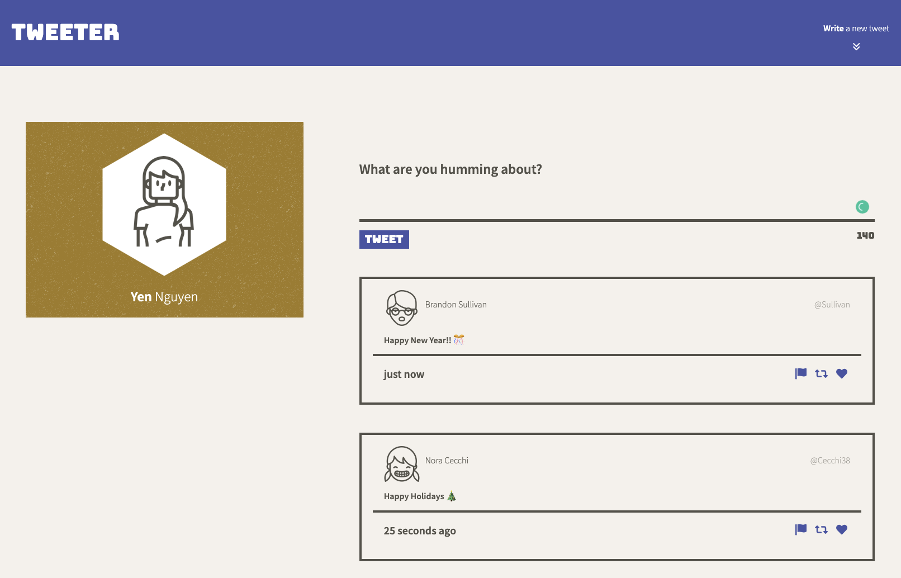

# Tweeter Project

Tweeter is a simple, single-page Twitter clone.

# Project Description

The starter code was provided by Lighthouse Labs, and was completed by [Yen Nguyen](https://github.com/yen-hnguyen).

Tweeter users can create new tweets of up to 140 characters. The design is responsive that adjust smootly to different screen sizes. This project was build using HTML, CSS, JS, jQuery, AJAX, Node and Express. 

## Final Product

### Compose new tweets

### Error display feature

### Website on Mobile/Tablet device

### Webiste on Desktop device

## Getting Started

1. [Create](https://docs.github.com/en/repositories/creating-and-managing-repositories/creating-a-repository-from-a-template) a new repository using this repository as a template.
2. Clone your repository onto your local device.
3. Install dependencies using the `npm install` command.
3. Start the web server using the `npm run local` command. The app will be served at <http://localhost:8080/>.
4. Go to <http://localhost:8080/> in your browser.

## Dependencies

- express
- node 5.10.x or above
- body-parser
- chance
- md5
- nodemon
- sass
